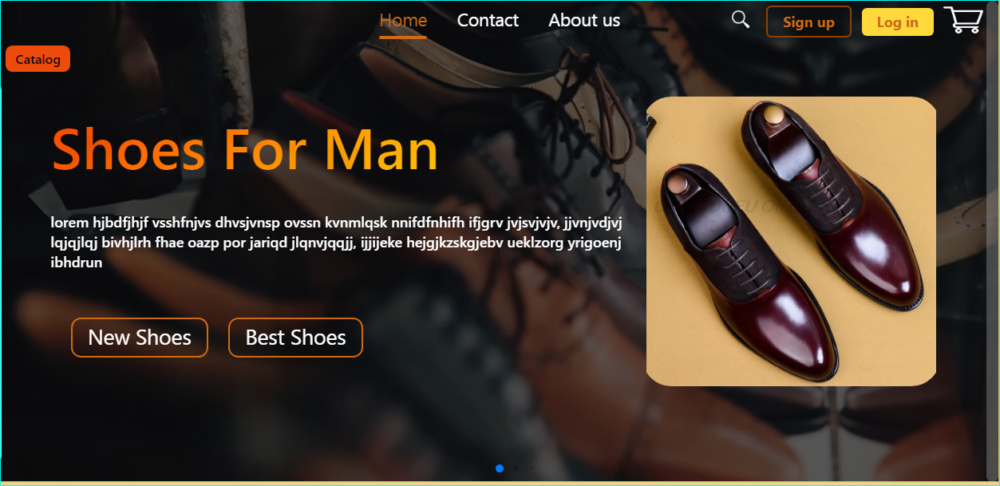
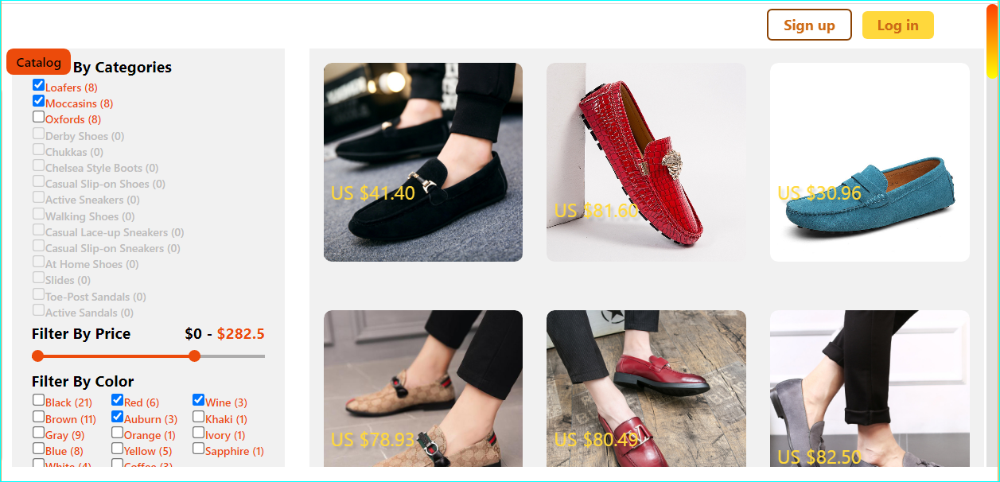
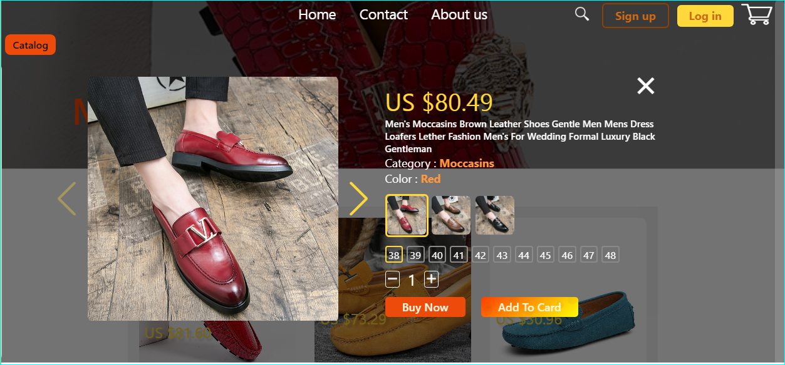

# LucDev-Shoes 
>An web ecommerce application for selling men's shoes.
>Live demo [here](https://momo-app-99600.web.app)

## Table of Contents 
* [General Info](#general-information)
* [Technologies Used](#technologies-used)
* [Features](#features)
* [Screenshots](#screenshots)
* [Setup](#setup)
* [Usage](#usage)
* [Project Status](#project-status)
* [Room for Improvement](#room-for-improvement)
* [Acknowledgements](#acknowledgements)
* [Contact](#contact)
<!-- * [License](#license) -->

## General Information 
* LucDev-Shoes is an application that illustrates a Web site 
  of e-commerce. The application has 120 products (men shoes)
  classified in 15 different categories. Each product has several colors that each have an image 
  each have a picture that is detailed on the product page. 
  I took the products from AliExpress. By creating this application,
  my goal is to prove my skills in React and Javascript. 

## Technologiees Used
* react 17 
* react-router-dom 6 
* react-redux 7.2
* @reduxjs/toolkit  1.8
* firebase 9.6
* prop-types 15.8
* sass 1.43
* swiper js 8
* drift-zoom 1.5

## Features 

* Authentication system with firebase
* Data filtering system by category, color and price. 
* Dynamic research
* A list of similar products in the same product category that changes when the relevant product page loads
* A mouse slider with decreasing velocity
* The capacity to see the details of a product in modal
* Different custom scroll bars
* An infinite slide loop 
* A thumbs galery

## Screenshots 
* Home page 

* Data filtering by category, color, and price

  
* Product detail in modal

## Setup 
To setup you can simply clone this ecommerce-demo repository and
install the dependencies.  
the project dependencies are listed in the package.json file in src folder

## Usage 
* clone
`git clone https://jean-luc14.github.io/LucDev-Shoes`

* Install dependencies with this command:
`npm install`

* Run the application with this command:
`npm start`

<!-- informations d'identification pour accéder au panneau d'administration
 (e-mail : admin@admin.com, mot de passe : password) -->

## Project Status 
The LucDev-Shoes project is under development

## Improvement 
* Improvement of the search function that uses the search bar
* Enhancement of the product filtering function by color so that the image
  of the product map in the search results is replaced by the 
  image of the last color checked in the color filter

## Acknowledgements 
* This project was based on [this tutorial.](https://youtu.be/fUdrXQ72670)

## Contact  
Created by jean-luc free to contact me! 
  